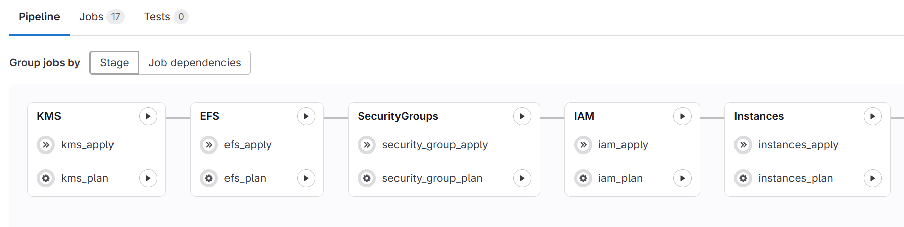

# Terraform SAP on AWS

Welcome! Here you will find the required Terraform resources required to deploy a base SAP environment, comprised of KMS keys, EFS, Security Groups, IAM and EC2 Instances.

Find the full guidance on how to use this code on [the official blog post](https://aws.amazon.com/blogs/awsforsap/terraform-your-sap-infrastructure-on-aws-2/)

## Getting started

1. Fork this repository [aws-sap-terraform](https://github.com/aws-samples/aws-sap-terraform) into your own account. [How to fork?](https://docs.github.com/en/pull-requests/collaborating-with-pull-requests/working-with-forks/fork-a-repo)
2. Navigate through the folders in the specific order: KMS, EFS, Security Groups, IAM, Instances and **fill in the files named "dev.tfvars" on each folder** according to what your environment requires. More information on how to fill in these files can be found on each specific resource page under Configurations in the left menu. **IMPORTANT:** The file as well as the branch names have to match the environment you are deploying to. If you are deploying dev, keep dev.tfvars and use dev branch. If you are deploying qa, create a new file called qa.tfvars and create a qa branch. If you are deploying prod, create the prod.tfvars file and create/use a branch named prod. More information **below on section Branch Strategy**.
3. At each of the folder take a look and update as required at the ```locals.tf``` file (example [kms/locals.tf](https://github.com/aws-samples/aws-sap-terraform/blob/main/kms/locals.tf)). These files contain all the tags to be attached to the resources of that configuration. Update them as required.
4. Push your updated code to your repository.
5. Add tag key "sap_relevant" and value "true" to the VPC you're using for this deployment.

6. Add tag key "sap_relevant" and value "true" to the Subnets you're using for this deployment. This will affect where resources will be created. Make sure you apply this tag to all the subnets that will receive an SAP application.

7. Continue to section below "How to deploy"

## How to deploy

Below you'll find straight forward instructions to deploy the code using a GitLab pipeline. If you are using some other CI/CD tool like Jenkins or GitHub Actions, go ahead and create your deployments files to replace the existing .gitlab-ci.yml and efs/gitlab/pipeline.yaml, iam/gitlab/pipeline.yaml and etc.

If you decide to use the GitLab CI/CD pipeline, update [.gitlab-ci.yml](https://github.com/aws-samples/aws-sap-terraform/blob/main/.gitlab-ci.yml) with the corresponding values for your branch names, AWS account numbers, AWS regions, and AWS IAM role. The file is configured with the following stages and corresponding job definitions. Once you push your updated code according to step 4 above, a new pipeline execution will be created, and once you open it, you'll see the screen below:



Now follow the order below to deploy your resources on the AWS account.

### Creation sequence

| Sequence | Stage | Jobs | Configuration
|------|-------|-----|-----
|1|KMS|kms_plan, kms_apply| [KMS](kms/README.md)
|2|EFS|efs_plan, efsS_apply| [EFS](efs/README.md)
|3|Security Groups|security_groups_plan, security_groups_apply| [Security Groups](security_group/README.md)
|4|IAM|iam_plan, iam_apply| [IAM roles and policies](iam/README.md)
|5|Instances|instances_plan, instances_apply| [EC2 Instances](ec2_instance/README.md)

## Branch strategy

- The recommended branch strategy for SAP deployments is the environment branch. Take a look at the links below to get more details on Environment branches:
  - [What is an Environment Branch strategy](https://www.wearefine.com/news/insights/env-branching-with-git/)
  - [How to work with environment branches](https://docs.dataops.live/docs/environment-management/branching-strategies/#overview-git-branches)
- In summary:
  - Each branch holds the code to its corresponding SAP environment. dev branch will have dev code. qa branch will have qa branch and so on.
  - Branches are always named lower case.
  - Merging code from a lower environment (dev branch) to a higher environment (qa branch) has to always be possible. If you can't merge your code between branches, it means you're not testing your code in the lower environment before updating higher environments, which is extremely risky for any application.
  - Code should (1) be always written in a feature branch, (2) then merged into dev branch, deployed and tested, and only when approved, (3) promoted via [Merge Requests](https://docs.github.com/en/pull-requests/collaborating-with-pull-requests/incorporating-changes-from-a-pull-request/merging-a-pull-request) to qa and so on.

## Folder structure 

There's one folder for each type of AWS core resource created by this solution (Amazon EC2 instances, Security Groups, Amazon Elastic File Systems, AWS KMS encryption keys, and AWS IAM permission policies and roles). 
SAP Landscapes often involve a large number of servers. Each server requires a number of AWS resources to be created. Terraform state files can quickly grow into very large, hard to manage state files. The proposed folder structure  will result in one Terraform state file for each resource type.  

Configuration of resources and the corresponding resource modules are all included in this single repository. Certain customers require this structure for audit and compliance purposes. The solution can be changed to have the resource configuration and modules separated into two different repositories. 

## Security

See [CONTRIBUTING](CONTRIBUTING.md#security-issue-notifications) for more information.

## License

This library is licensed under the MIT-0 License. See the LICENSE file.
